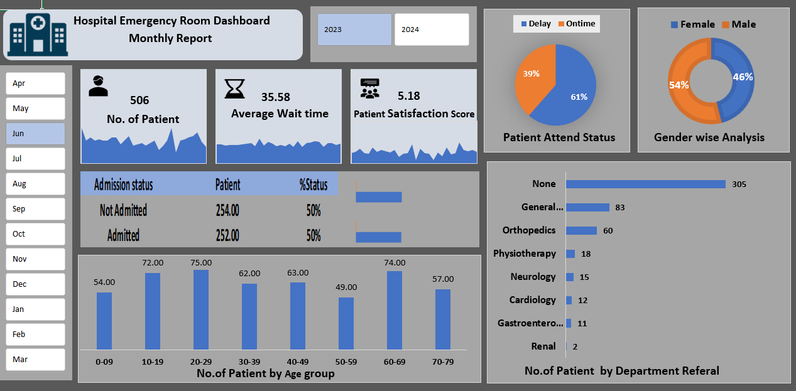

# 🏥 Hospital Emergency Room Dashboard

## 📌 Project Overview
An interactive Hospital Emergency Room Dashboard created in Microsoft Excel for analyzing patient and hospital performance data.

## 🛠 Tools & Features Used
- Microsoft Excel
- Power Query
- Power Pivot
- Pivot Tables
- Pivot Charts
- Slicers
- Data Cleaning
- Data Modeling
- Dashboard Design

## 📊 Dashboard Insights
- Total Patients
- Average Wait Time
- Patient Satisfaction Score
- Admission Status
- Patient Attendance Status
- Gender-wise Analysis
- Department Referral Analysis
- Age Group Analysis
- Year Filter (2023 & 2024)

## 📁 Files Included
- Hospital_Emergency_Room_Dashboard.xlsx
- Hospital_Dashboard.png

## 📷 Dashboard Preview

